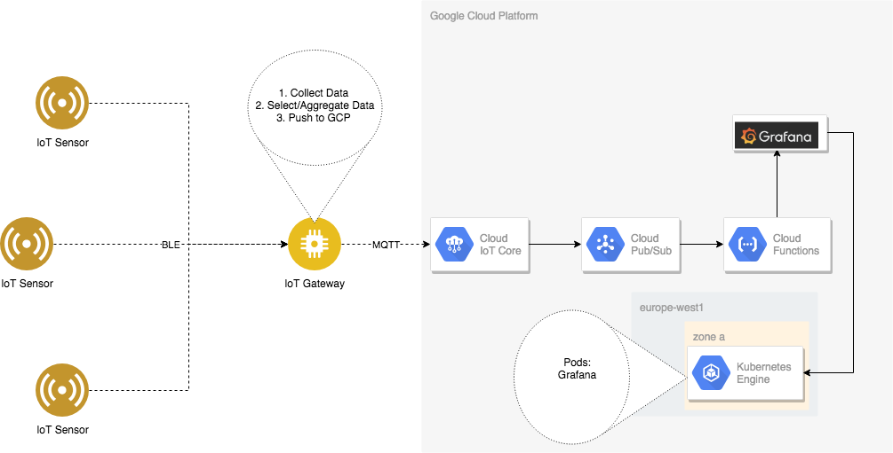

This tutorial shows you how to set up end to end data ingestion and visualization pipeline. Using a IoT sensor module as data generator and a Raspberry Pi board as gateway relays the sensor metrics data to google cloud platform.  On the cloud side google cloud IoT Core is the integration product that handles the data coming from Raspberry Pi and delivers it to Cloud PubSub, the massive scale data messaging service. Integrated with PubSub is cloud function that normalizes and cleans the metrics data and writes it into a InfluxDB, a open source database optimized for handling time series data. For visualization Grafana is used that has out-of-box connector to influxDB

## Architecture
High level overview of the solution setup


## Objectives
- Setup Raspberry Pi to receive sensor metrics
- Setup IoT Core registry, gateway and device for sensor and Raspberry Pi
- Setup Cloud Functions that handles processing of metrics data
- Setup Infux data for data storage
- Setup Grafana for data visualization

## Required hardware
- Raspberry Pi board with build in Bluetooth or usb Bluetooth adapter
- [SensiEdge SIMBA-PRO](https://www.sensiedge.com/product-page/simba-pro) board
- Laptop or Desktop computer with command line shell and internet connectivity

## Raspberry Pi Setup
- Follow the [basic guide](https://www.raspberrypi.org/downloads/raspbian/) for installation of Raspbian on the board
- Install helper libs
```
$ sudo apt-get update
$ sudo apt-get install python-pip libglib2.0-dev gcc libffi-dev libssl-dev python-dev
```
- Follow the setup up [guide](https://github.com/STMicroelectronics-CentralLabs/BlueSTSDK_Python) for BlueST SDK
- Check out source repository:
```
$ git clone https://github.com/kingman/iot-demo.git
$ sudo cp iot-demo/sample/feature.py /usr/local/lib/python2.7/dist-packages/blue_st_sdk/feature.py
$ sudo pip install -r iot-demo/sample/requirements.txt
```

## Cloud IoT Core setup
- Generate key pair on Raspberry Pi
```
$ openssl req -x509 -newkey rsa:2048 -keyout rsa_private.pem -nodes -out rsa_cert.pem -subj "/CN=unused"
```
- Move the private key a secure folder that can be access later. And make sure you can copy the public key when creating the gate ways device in the later step.
- Open the [Cloud IoT Core console](https://console.developers.google.com/iot)
- Click the **CREATE REGISTRY** button
- Create a registry by fill in
  - Registry ID
  - Select a region near your location
  - Make sure MQTT protocol is selected
  - Create a Pub/Sub topic for telemetry data on the flight
  - Press the Create button
- Create gateway
  - In the [Cloud IoT Core console][https://console.developers.google.com/iot], click on the registry you created.
  - Under the **Gateways** tab, click **Create Gateway**.
  - Enter the **Gateway ID**, write done the value for environment configuration on raspberry pi.
  - Choose key format **RS256_X509**
  - Copy the contents of `rsa_cert.pem` into the public key text area.
  - For **Device authentication method**, select **Association only**. For more details about why this option is used, see [Extra notes](#extra-notes) below.
- Create end device
  - In the [Cloud IoT Core console][https://console.developers.google.com/iot], click on the registry you created.
  - Under the **Devices** tab, click **CREATE A DEVICE**.
  - Enter the **Device ID**, write done the value for environment configuration on raspberry pi.
  - Leave everything else blank or as-is. You don't need to enter a public key since the device will be authenticated through the gateway.

## Deploy simple Cloud Functions for debugging
- In the [Cloud Functions console](https://console.developers.google.com/functions)
- Click the **CREATE FUNCTION** button
- Create a function by fill in
  - **Name**
  - **Trigger** Cloud Pub/sub
  - **Topic** choose the topic created when creating registry from drop down
  - Press **Create** button

## Streaming data through gateway as gateway
- On Raspberry Pi set the necessary environment variables
```
$ cd iot-demo/sample
$ cp set_env_template set_env.sh
```
  - Set the parameter values that matches your cloud setup
    - Use the gateway id you created as DEVICE_ID
    - comment out the GATEWAY_ID line for now
  - Save and set the environment variables
```
$ source set_env.sh
```
- Download [Google's CA root certificate](https://pki.goog/roots.pem) into the same directory
```
$ wget https://pki.goog/roots.pem
```
- Power on the Simba sensor by inserting the battery
- Start the BLE receiver client
```
$ sudo -E python mqtt_streaming.py
```
- Select device named: `SensiBLE`
- Select the features to stream to cloud
- Verify the metrics data at Cloud Functions log
  - In the [Cloud Functions console](https://console.developers.google.com/functions)
  - Choose the function created for debugging
  - Click the **VIEW LOGS** button

## Streaming data through gateway as device
- Change the cloud function to also log the device information of the Pub/Sub message
  - In the [Cloud Functions console](https://console.developers.google.com/functions)
  - Choose the function created for debugging
  - Click the **EDIT** button
  - Replace the content of index.js file with following
  ```javascript
  exports.sense = (event, callback) => {
    const pubsubMessage = event.data;
    var msgStr = Buffer.from(pubsubMessage.data, 'base64').toString();
    console.log('%s %O', msgStr, pubsubMessage.attributes);
    callback();
  };
  ```
  - Click the **Save** button
- Start metric data streaming from Raspberry Pi and verify the device information in the Cloud Functions log. Notice the deviceId is the gateway
- Re-configure environment variables to streaming as device through gateway mode
  - Change the `DEVICE_ID` value to device id created in cloud
  - Uncomment `GATEWAY_ID` field and assign it the gateway id
  - Set the environment variables
  ```
  $ source set_env.sh
  ```
- Start metrics data streaming again and verify in Cloud Functions log that the device information has change to the new value. Also notice the presence of the new gatewayId field.

## Setup InfluxDB
- TBD

## Setup Grafana
- TBD

## Change the Cloud Functions to write to InfluxDB
- In the [Cloud Functions console](https://console.developers.google.com/functions)
- Choose the function created for debugging
- Click the **EDIT** button
- Replace the content of index.js with content of `cloud/index.js`
- Replace `{fluxdb_adress}` with InfluxDB address
- Replace the content of package.json with content of `cloud/package.json` file
- Change the **Function to execute** field to `sense`
- Click the **Save** button

## View metrics stream from Grafana dashboard
- Start metrics data streaming from Raspberry Pi
  - choose multiple features to stream
- From Grafana dashboard verify graph values reflex the mestric values that are being streamed
