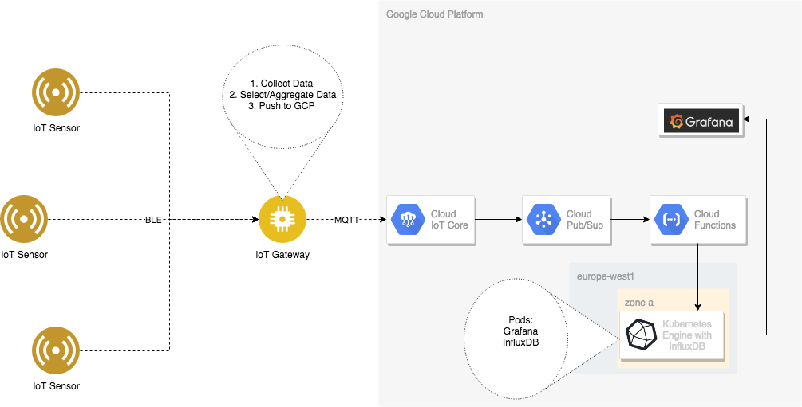

This tutorial shows you how to set up end to end data ingestion and visualization pipeline. Using a IoT sensor module as data generator and a Raspberry Pi board as gateway relays the sensor metrics data to google cloud platform.  On the cloud side google cloud IoT Core is the integration product that handles the data coming from Raspberry Pi and delivers it to Cloud PubSub, the massive scale data messaging service. Integrated with PubSub is cloud function that normalizes and cleans the metrics data and writes it into a InfluxDB, a open source database optimized for handling time series data. For visualization Grafana is used that has out-of-box connector to influxDB

## Architecture
High level overview of the solution setup


## Objectives
- Setup Raspberry Pi to receive sensor metrics
- Setup IoT Core registry, gateway and device for sensor and Raspberry Pi
- Setup Cloud Functions that handles processing of metrics data
- Setup Infux data for data storage
- Setup Grafana for data visualization

## Required hardware
- Raspberry Pi board with build in Bluetooth or usb Bluetooth adapter
- [SensiEdge SIMBA-PRO](https://www.sensiedge.com/product-page/simba-pro) board
- Laptop or Desktop computer with command line shell and internet connectivity

## Raspberry Pi Setup
- Follow the [basic guide](https://www.raspberrypi.org/downloads/raspbian/) for installation of Raspbian on the board
- Install helper libs
```
$ sudo apt-get install python-pip libglib2.0-dev
```
- Follow the setup up [guide](https://github.com/STMicroelectronics-CentralLabs/BlueSTSDK_Python) for BlueST SDK
- Check out source repository:
```
$ git clone git@github.com:kingman/iot-demo.git
```

## Cloud IoT Core setup
- Generate key pair on Raspberry Pi
```
$ openssl req -x509 -newkey rsa:2048 -keyout rsa_private.pem -nodes -out rsa_cert.pem -subj "/CN=unused"
```
- Move the private key a secure folder that can be access later. And make sure you can copy the public key when creating the gate ways device in the later step.
- Open the [Cloud IoT Core console](https://console.developers.google.com/iot)
- Click the CREATE REGISTRY button
- Create a registry by fill in
  - Registry ID
  - Select a region near your location
  - Make sure MQTT protocol is selected
  - Create a Pub/Sub topic for telemetry data on the flight
  - Press the Create button
  
